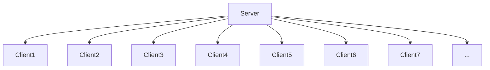

# NovaRAT 远程控制软件

NovaRAT是一款强大的远程管理和控制工具，具备以下主要特性：

## 主要特性

1. **多用户同时控制：** NovaRAT允许多个管理员同时远程控制多台计算机，提供高度的灵活性和效率。

2. **一键执行CMD命令：** NovaRAT提供了一个直观的命令行界面，允许管理员远程执行命令和脚本，以便在目标计算机上执行特定任务。这大大简化了远程操作和维护。

3. **安全的TCP加密连接：** NovaRAT采用强大的TCP加密连接，确保数据在传输过程中的安全性和机密性。这有助于保护远程通信的隐私。

4. **多用户日志管理：** NovaRAT具备多用户日志管理功能，可用于记录和监视远程操作，以便跟踪管理员的活动。这对于安全审计和追踪非常有用。

## 示意图

以下示意图展示了NovaRAT服务器如何连接到多个客户端的情况：

> 说明：这张示意图展示了NovaRAT服务器与多个客户端建立加密TCP连接，使管理员能够远程控制和管理多台计算机。

NovaRAT是一款多功能的远程控制工具，适用于各种用途，包括远程支持、系统管理和监控等任务。
